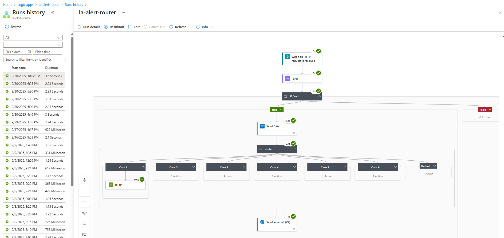
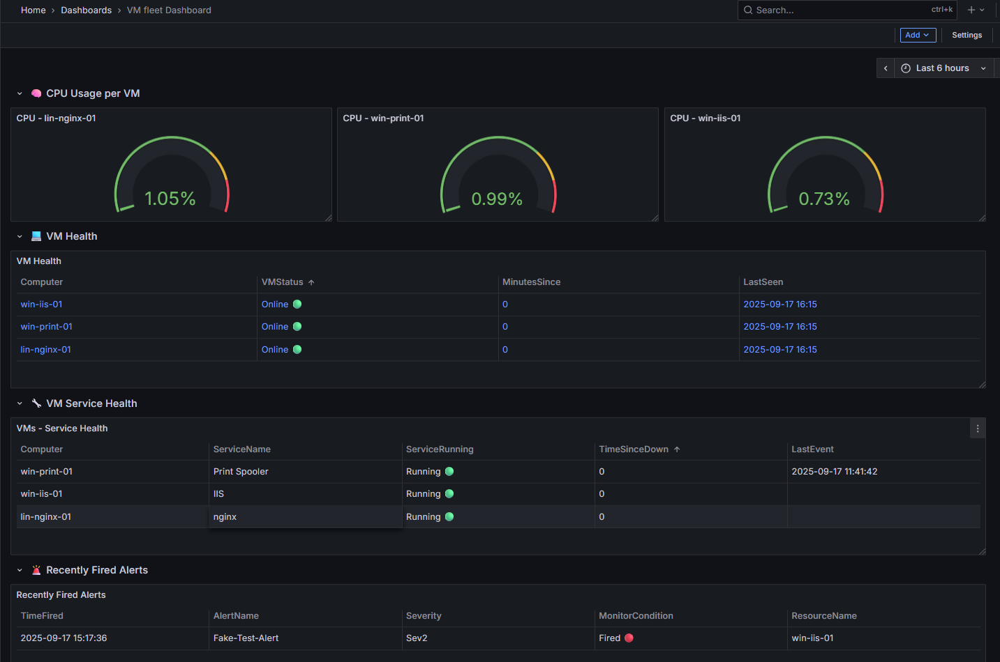

# Azure Monitoring & Automated Remediation Project

## 📌 Project Summary
This project demonstrates how Azure Monitor, Automation Runbooks, Logic Apps, and Grafana can be combined into a **self-healing infrastructure monitoring solution**.  

By using metrics and log-based alerting tied to automated remediation scripts, I built an environment where common VM and service failures are detected and fixed automatically — with notifications and dashboards providing full visibility.  

The design choices (Bicep for infrastructure, console for identity/monitoring config, Logic App for routing, Grafana for visualization) were intentional, ensuring I gained exposure to multiple Azure disciplines while keeping the build realistic to what enterprises actually use.  

Through testing, I validated that failures in services like IIS, Nginx, and the Windows Print Spooler were detected and remediated within minutes, reducing downtime and meeting real-world recovery objectives.  

### SET UP 
This Project was designed and configured in 6 main parts and will follow the same structure in this .README file: 

- Infrastructure
- Automation  
- Monitoring 
- Querying 
- Routing/Notification via Logic App 
- Visualization 

---

## 🏗️ Infrastructure 

The reason for the split in infrastructure deployment was mainly down to the fact that Since my background is stronger in Terraform and AWS, I deliberately chose Bicep and the Azure portal here to strengthen Azure-specific skills while still applying IAC best practices, it was a win win and a good way to showcase a new IAC language under my belt. 

### Bicep deployed Infrastructure 
- **Resource Group:** `aim-dev-rg`  
- **Cloud Networking Principles** Vnet, Subnets, Network Security groups.
- **Azure VMs:**  with extensions for ease of deployment 
  - Windows Server (IIS)  
  - Windows Server (Print Spooler)  
  - Linux VM (Nginx)
    
### Console deployed Infrastructure
- **Log Analytics Workspace (LAW)** + **Data Collection Rule (DCR)**  
- **Azure Automation Account** with System-Assigned Identity  
- **Runbooks** (PowerShell + Bash)  
- **Azure Monitor** for metrics and log-based alerts  
- **Logic App** for alert-driven notifications/workflows  
- **IAM** all identity access management was configured via the console, for this deployment there was minimal IAM setup needed.

Please see folder attached with all Bicep files - [Bicep Files](https://github.com/HarveyAland/auzre-monitoring-remediation/tree/main/bicep%20files):

---
## Automation 
The Automation side of this project was done inside the configured aim-auto automation account. 

After the main VMs were created i went on the build and test the automation scripts the VMs would be configured to run when they need to be remediated. 

This is a section i could have happily spent much more time on and really dived into the remediation side but as per the project scope this is as much as a monitoring project as it is about infra remediation. 

The RunBooks were created in mind of production level issues within VMs and servers that most reading will have been at the mercy of at least once in our professional careers, the waiting time can be agonizing especially in my case when i have an end user waiting on me to provide access to a system that is currently down. 

this model solves a lot of that with the monitoring and automatic remediation of services and VMs with some of my tests even proving a RPO time of <4mins which is above gold standard. 

 
### ⚙️ Runbooks Implemented 

| Runbook | Target | Purpose |
|---------|--------|---------|
| Restart/Start VM | Windows/Linux | Restart VM if heartbeat is missing (auto-heal). |
| Restart IIS (W3SVC) | Windows (IIS) | Recovers IIS web service when stopped/crashed. |
| Recycle IIS App Pool | Windows (IIS) | Clears hung app pool sessions without reboot. |
| Restart Print Spooler | Windows (Print Server) | Ensures print service availability. |
| Restart Nginx | Linux (Nginx VM) | Auto-recover Nginx service when stopped. |
| Clean Disk (Linux) | Linux VM | Deletes temp/cache files if disk space < 10%. |

- As you will find in the table above there are more Runbooks here than are set up to rules, not all run books would realistically be automatically spun, some needing reviewed and some troubleshooting steps taken before hand. this would be the case with the IIS app hanging for example, only way you would know for certain is if you test it yourself first.

Please see folder attached with all Runbook Scripts used - [Runbook Scripts](https://github.com/HarveyAland/auzre-monitoring-remediation/tree/main/Runbook%20Scripts)

---

## 📡 Monitoring & Alerts

Monitoring was at the core of this project — it tied together metrics, logs, automation, and visualization into a **closed self-healing loop**:

**Detect → Alert → Runbook Remediation → Notify → Visualize**

### 🔍 How It Works

1.  **Metrics Collection**
    
    -   Metrics such as CPU, disk, memory, and heartbeat were collected directly from each VM.
        
    -   This was enabled through the **Azure Monitoring VM extensions**, which continuously gather performance data and forward it to **Log Analytics Workspace (LAW)**.
        
2.  **Log Collection**
    
    -   Logs included **Heartbeat, Windows Event Logs, and Linux Syslog**.
        
    -   A **Data Collection Rule (DCR)** was configured to ensure that both Windows and Linux VMs were sending the correct events into LAW.
        
3.  **Alert Rules**
    
    -   Alert rules were defined to evaluate **metrics thresholds** or **KQL query results**.
        
    -   When conditions were met, the alert entered a **fired** state.
        
4.  **Action Group → Logic App**
    
    -   Instead of linking each alert directly to a Runbook (which doesn’t scale well), all alerts were funneled into a **single Action Group**.
        
    -   This Action Group triggered a **Logic App**, which parsed the incoming alert data and matched it to the correct remediation workflow.
        
5.  **Automation & Notification**
    
    -   The Logic App invoked the matching **Automation Runbook**, which executed remediation on the affected VM.
        
    -   Once complete, the Logic App also sent a **notification via email** (and could be easily extended to Teams, ServiceNow, or webhooks).
        

----------

### ⚡ Configured Alerts

The following key alerts were implemented as part of the monitoring design:

-   **Heartbeat Loss** → Triggers the VM restart Runbook.
    
-   **CPU Usage (Linux)** → Fires when CPU remains above threshold for a sustained period.
    
-   **IIS Service Stopped** → Triggers the IIS restart Runbook.
    
-   **Print Spooler Service Stopped** → Triggers the Print Spooler restart Runbook.

- **Nginx Service Stopped** → Triggers the Nginx service restart Runbook
    

> Each alert was tied to a Logic App workflow that mapped it to the correct remediation Runbook.

### 🔄 Custom Service Health Checks for Grafana Dashboard 

One of the first challenges I encountered was that log-based monitoring is **event-driven**. It only reports when a service changes state. That meant dashboards could misleadingly show a service as healthy, simply because the last event was from hours ago - even if the service had since gone offline.

To address this, I combined **event-driven alerts** for alerts with a **scheduled heartbeat stream** for dashboards across a mixed environment of two Windows VMs and one Linux VM. This provided a consistent **2-minute detection window** for failures, bridging the gap between event-based alerts and real-time monitoring.

-   On **Windows**, the job ran as a Task Scheduler task at startup and every 2 minutes thereafter.
    
-   On **Linux**, the job was implemented with a cron job (or systemd timer) at the same interval.

-   All jobs were configured to run thier own scripts 
    

The script ran by the task did the following:

-   Checked the status of critical services (IIS, Print Spooler, and Nginx).
    
-   Wrote the current result into **Event Log** (Windows) or **syslog** (Linux).
    
-   Ensured these entries were ingested into **Log Analytics Workspace (LAW)** through the Data Collection Rule (DCR).
    

This approach guaranteed a fresh status signal every two minutes, preventing dashboards from relying on stale event data and giving Grafana a continuous time-series view of service health. In operations, this reduced **mean time to detect (MTTD)** failures and ensured dashboards reflected live service status.

The trade-off is that scheduled jobs require local configuration on each VM, and if a job fails its heartbeat is lost. By contrast, AMA performance counters or Grafana’s native telemetry are cleaner, scalable options for production environments. But for this lab, the hybrid approach delivered both accurate event-based alerts and reliable near real-time dashboards, while clearly demonstrating the difference between **event-driven monitoring** and **heartbeat monitoring**.

---
## KQL Query Validation

Arguably the longest part of this project was the querying and testing of events though LAW. It was an never-ending battle of stress testing queries to make sure they worked in all circumstances. 

Many times, a query that appeared correct in one test would fail in another because I hadn’t accounted for a specific condition. This constant cycle forced me to refine queries repeatedly until they were reliable.

A good example was the **service down alert**. When a VM crashed, the service running on it would obviously be down as well — meaning both the VM failure alert and the service down alert could fire simultaneously, creating duplicate alerts. To resolve this, I added a **Heartbeat check** so the service alert would only trigger if the VM itself was still healthy.

I also:

-   Added a **`Computer` field filter** so queries were tied to the correct VM, preventing cross-VM false positives.
    
-   Introduced a **5-minute suppression period** to prevent a single VM’s alert from repeatedly firing on the same event.

-   Set **Alert Rule** Evaluation time to every 5 minutes.  
    

These changes eliminated redundant alerts and made the monitoring rules much more reliable.

👉 Please see all queries for the alert rules in the queries folder [Alert Rule Queries](https://github.com/HarveyAland/auzre-monitoring-remediation/tree/main/Log%20KQL%20Querys/Alert%20Rule%20Querys)

---
## 🔔 Logic App Integration
The theory behind the implementation of the logic app is simple, if this were a full sized enterprise level deployment there might be 150+ alert rules monitoring different metrics which would you would need equal part action groups to fire just the one rule that has been triggered. 

The Logic App acts as a filter, taking in the fired alert rule data, phasing it through the filter and firing the correct run book that has to equal the name of recently fired alert rule. 

All of the configuration for this was done through the portal logic app editor which was very interactive, seems like the avenues you can go down with this resource is endless. 

With options to build out the automation with links to create Servicenow Tickets from events, webhooks for messages into teams groups ect, i only used this logic app for my current work need but the reality is the possibility to build out and expand with this automation work frame tool is pretty impressive.   

### My Use Case 
- Filtering alert rules to fire specific run books that match the phase criteria 
- Decoupled from remediation (runbooks).  
- Can extend to email, Teams, ServiceNow, etc.  

### How it works for me 
This Logic App is triggered when an HTTP request (Azure Monitor alert) is received. The payload is parsed, and the workflow checks if the alert’s **monitorCondition** is set to _Fired_. If not, it ends. If it has fired, the alert details (name, severity, time, and target resource) are logged to Log Analytics. The app then uses a **Switch** action on the alert rule name to decide which Automation Runbook to start. Each case corresponds to a specific alert (e.g., IIS restart, VM restart, print service restart, Nginx restart/cleanup). If no case matches, it simply records the normalized alert rule name without running a job. Authentication to Automation uses the Logic App’s Managed Identity.

### Logic App Diagram

Here we have a clear depiction of the logic app workflow during a succesful run. 

---

## 📊 Visualization with Grafana
Grafana was a no brainer when choosing what tool I would be using for the visualization section on this project. Creating dashboard was very straightforward and was the part I had the most fun with, I feel like with a bigger deployment in a real production environment you could to really utilize the power of Grafana!

The Dashboard is split into 4 rows and you can find the LAW queries for them in the folder attached - [Grafana Dashboard Queries](https://github.com/HarveyAland/auzre-monitoring-remediation/tree/main/Log%20KQL%20Querys/Visulization%20Querys) 

Following this structure really ties the system together: SMEs and NOC engineers can **see system state, recent failures, and whether automation handled them**.

**CPU** - Monitoring the CPU of each VM in their own individual panel with threshold markers added at 40%, 70% and 85% to help aid in the visualization. No kql query was needed for this table as i used azure vm insights to gather the cpu data. Please see screenshot for configuration - [CPU Panel in Grafana](

**VM Health** - Using a heartbeat based query to monitor and output the health status of the VMs and pulling two important metrics (Minuets Since & Last Seen) which tell you when the last HB was and how long its been since its last been online.

**Service Health** - Pulling the Service data from a custom log i had set up, the Service Health follows a similar style to the VM Health table above again incorporating the Last Seen tab. 

**Most Recent Fired Alert** - Using the fired alert data that's fed into LAW from the logic app, this query table is a nice addition for this dashboard. 

---

## 🧪 Testing & Verification
This section documents how alerts and runbooks were validated. I wanted this document not to be just a bunch of screenshots back to back and instead save one dedicated section to a full workflow test and proof of concept showcasing not only the process but the time in which the remediation takes place. 

**Format:**  
1. **Step taken** (e.g., stopped IIS service).  
2. **Expected outcome** (alert triggers, runbook runs).  
3. **Evidence screenshot** (LAW query / Azure Job output / Grafana update).  
4. **Result summary** (alert + remediation worked).  

_Screenshots will be embedded here._  

---

