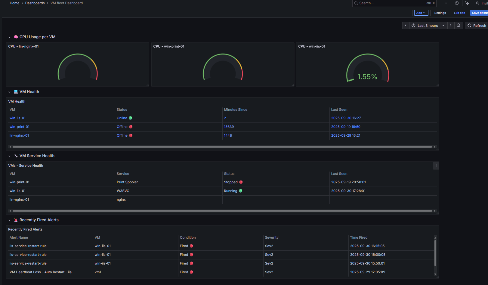
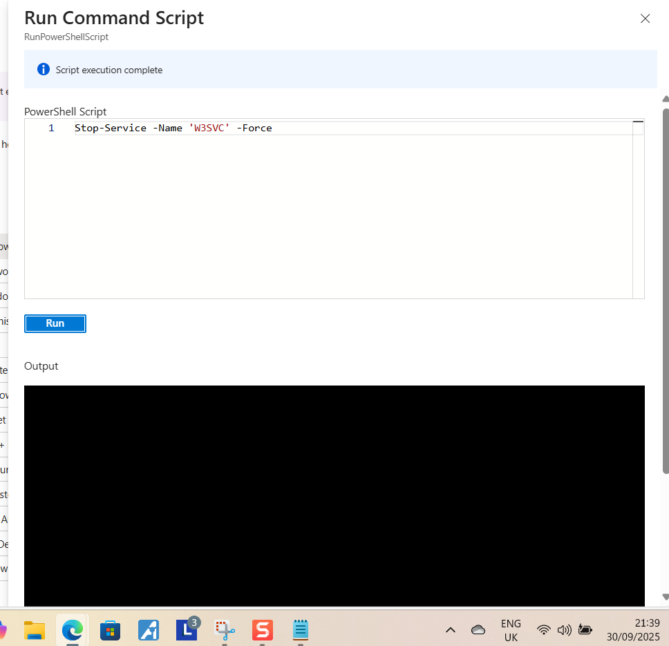
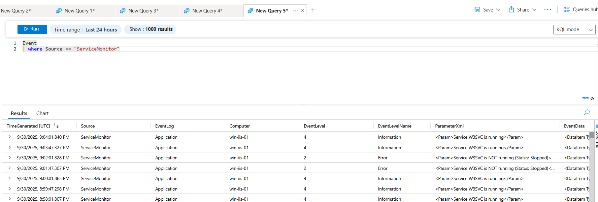
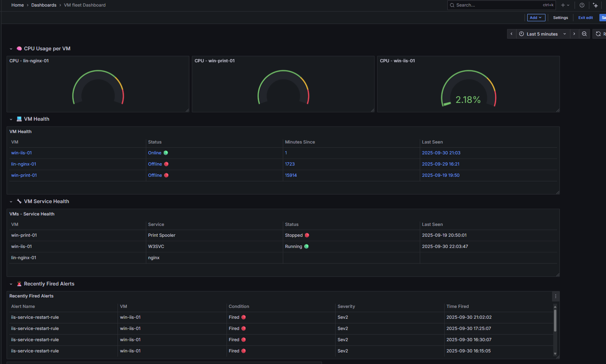
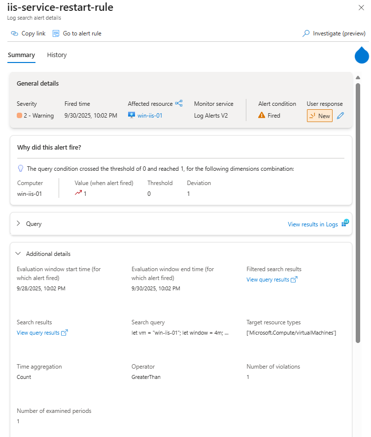
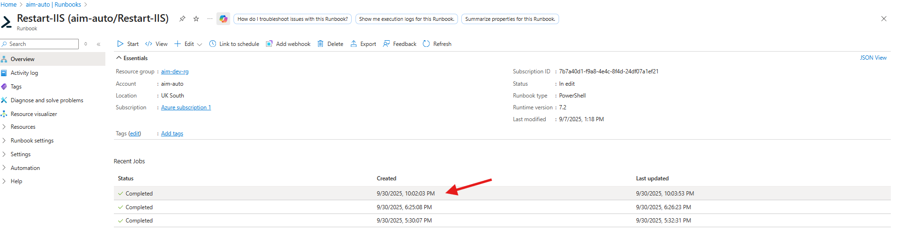
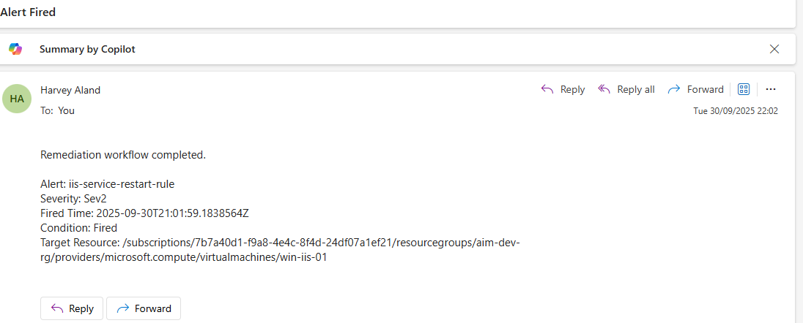

# Azure Monitoring & Automated Remediation Project

## 📌 Project Summary
This project demonstrates how Azure Monitor, Automation Runbooks, Logic Apps, and Grafana can be combined into a **self-healing infrastructure monitoring solution**.  

By using metrics and log-based alerting tied to automated remediation scripts, I built an environment where common VM and service failures are detected and fixed automatically — with notifications and dashboards providing full visibility.  

The design choices (Bicep for infrastructure, console for identity/monitoring config, Logic App for routing, Grafana for visualization) were intentional, ensuring I gained exposure to multiple Azure disciplines while keeping the build realistic to what enterprises actually use.  

Through testing, I validated that failures in services like IIS, Nginx, and the Windows Print Spooler were detected and remediated within minutes, reducing downtime and meeting real-world recovery objectives.  

**Tech Stack:** Azure Monitor • Log Analytics Workspace (LAW) • Data Collection Rules (DCR) • Automation Runbooks • Logic App • Bicep • PowerShell • Grafana

### SET UP 
This Project was designed and configured in 6 main parts and will follow the same structure in this .README file: 

- Infrastructure
- Automation  
- Monitoring 
- Querying 
- Routing/Notification via Logic App 
- Visualization 

---

## 🏗️ Infrastructure 

The reason for the split in infrastructure deployment was mainly down to the fact that Since my background is stronger in Terraform and AWS, I deliberately chose Bicep and the Azure portal here to strengthen Azure-specific skills while still applying IAC best practices, it was a win win and a good way to showcase a new IAC language under my belt. 

### Bicep deployed Infrastructure 
- **Resource Group:** `aim-dev-rg`  
- **Cloud Networking Principles** Vnet, Subnets, Network Security groups.
- **Azure VMs:**  with extensions for ease of deployment 
  - Windows Server (IIS)  
  - Windows Server (Print Spooler)  
  - Linux VM (Nginx)
    
### Console deployed Infrastructure
- **Log Analytics Workspace (LAW)** + **Data Collection Rule (DCR)**  
- **Azure Automation Account** with System-Assigned Identity  
- **Runbooks** (PowerShell + Bash)  
- **Azure Monitor** for metrics and log-based alerts  
- **Logic App** for alert-driven notifications/workflows  
- **IAM** all identity access management was configured via the console, for this deployment there was minimal IAM setup needed.

All resources were deployed into a single environment with clear dependencies — every VM was linked to the same Log Analytics Workspace and Data Collection Rule to ensure consistent data ingestion and centralized alerting across the stack.

Please see folder attached with all Bicep files - [Bicep Files](https://github.com/HarveyAland/auzre-monitoring-remediation/tree/main/bicep%20files):

---
## Automation 
The Automation side of this project was done inside the configured aim-auto automation account. 

After the main VMs were created, I began building and testing the automation scripts that each VM would use for self-remediation when a fault occurred.  

This was one of the most enjoyable parts of the project — and one I could have easily expanded further. While the main focus was monitoring and alerting, automation played an equally important role by turning insights into real, measurable recovery actions. 

The RunBooks were created in mind of production level issues within VMs and servers that most reading will have been at the mercy of at least once in our professional careers, the waiting time can be agonizing especially in my case when i have an end user waiting on me to provide access to a system that is currently down. 

this model solves a lot of that with the monitoring and automatic remediation of services and VMs with some of my tests even proving a RPO time of <4mins which is above gold standard. 

 
### ⚙️ Runbooks Implemented 

| Runbook | Target | Purpose |
|---------|--------|---------|
| Restart/Start VM | Windows/Linux | Restart VM if heartbeat is missing (auto-heal). |
| Restart IIS (W3SVC) | Windows (IIS) | Recovers IIS web service when stopped/crashed. |
| Recycle IIS App Pool | Windows (IIS) | Clears hung app pool sessions without reboot. |
| Restart Print Spooler | Windows (Print Server) | Ensures print service availability. |
| Restart Nginx | Linux (Nginx VM) | Auto-recover Nginx service when stopped. |
| Clean Disk (Linux) | Linux VM | Deletes temp/cache files if disk space < 10%. |

- As you will find in the table above there are more Runbooks here than are set up to rules, not all run books would realistically be automatically spun, some needing reviewed and some troubleshooting steps taken before hand. this would be the case with the IIS app hanging for example, only way you would know for certain is if you test it yourself first.

Please see folder attached with all Runbook Scripts used - [Runbook Scripts](https://github.com/HarveyAland/auzre-monitoring-remediation/tree/main/Runbook%20Scripts)

---

## 📡 Monitoring & Alerts

Monitoring was at the core of this project — it tied together metrics, logs, automation, and visualization into a **closed self-healing loop**:

**Detect → Alert → Runbook Remediation → Notify → Visualize**

### 🔍 How It Works

1. **Metrics Collection**  
   - Metrics such as CPU, disk, memory, and heartbeat were collected directly from each VM using **Azure Monitor VM Insights**.  
   - These metrics were streamed continuously into the **Log Analytics Workspace (LAW)** for visualization and alert evaluation.

2. **Log Collection**  
   - Logs included **Heartbeat**, **Windows Event Logs**, and **Linux Syslog** entries.  
   - A unified **Data Collection Rule (DCR)** ensured both Windows and Linux VMs forwarded their respective service and performance logs to LAW.

3. **Alert Rules**  
   - Alerts were defined using either **metric thresholds** (e.g., CPU > 85%) or **KQL-based log queries** (e.g., service down).  
   - When a condition was met, the alert transitioned into a **Fired** state and triggered downstream automation.

4. **Action Group → Logic App**  
   - Rather than linking alerts directly to Runbooks (which doesn’t scale), all alerts were tied to a **single Action Group**.  
   - This Action Group invoked a **Logic App** that analyzed the alert payload and determined which Runbook to trigger based on alert name or tags.

5. **Automation & Notification**  
   - The Logic App authenticated via Managed Identity and called the corresponding **Automation Runbook** to perform remediation.  
   - Upon completion, it also sent **email notifications** — a process that could easily be extended to Teams, ServiceNow, or webhook integrations.

        

----------

### ⚡ Configured Alerts

The following key alerts were implemented as part of the monitoring design:

-   **Heartbeat Loss** → Triggers the VM restart Runbook.
    
-   **CPU Usage (Linux)** → Fires when CPU remains above threshold for a sustained period.
    
-   **IIS Service Stopped** → Triggers the IIS restart Runbook.
    
-   **Print Spooler Service Stopped** → Triggers the Print Spooler restart Runbook.

- **Nginx Service Stopped** → Triggers the Nginx service restart Runbook
    

> Each alert was tied to a Logic App workflow that mapped it to the correct remediation Runbook.

### 🔄 Custom Service Health Checks for Grafana Dashboard 

One of the first challenges I encountered was that log-based monitoring is **event-driven**. It only reports when a service changes state. That meant dashboards could misleadingly show a service as healthy, simply because the last event was from hours ago - even if the service had since gone offline.

To address this issue while visualizing the project infrastructure in Grafana, I combined event-driven alerts with a scheduled service status stream across a mixed environment of two Windows VMs and one Linux VM. This setup provided a consistent 2-minute detection window for service failures, effectively bridging the gap between event-based alerting and real-time monitoring.

-   On **Windows**, the job ran as a Task Scheduler task at startup and every 2 minutes thereafter.
    
-   On **Linux**, the job was implemented with a cron job (or systemd timer) at the same interval.

-   All jobs were configured to run their own scripts 
    

**Each scheduled script performed the following steps:**

-   Checked the status of critical services (IIS, Print Spooler, and Nginx).
    
-   Wrote the current result into **Event Log** (Windows) or **syslog** (Linux).
    
-   Ensured these entries were ingested into **Log Analytics Workspace (LAW)** through the Data Collection Rule (DCR).
    

This approach guaranteed a fresh status signal every two minutes, preventing dashboards from relying on stale event data and giving Grafana a continuous time-series view of service health. In operations, this reduced **mean time to detect (MTTD)** failures and ensured dashboards reflected live service status.

The trade-off is that scheduled jobs require local configuration on each VM, and if a job fails its heartbeat is lost. By contrast, AMA performance counters or Grafana’s native telemetry are cleaner, scalable options for production environments. But for this lab, the hybrid approach delivered both accurate event-based alerts and reliable near real-time dashboards, while clearly demonstrating the difference between **event-driven monitoring** and **heartbeat monitoring**.

---
## KQL Query Validation

Arguably the most time-consuming part of this project was querying and testing events through Log Analytics Workspace (LAW). It was a never-ending process of stress-testing queries to ensure they worked under all conditions. 

Many times, a query that appeared correct in one test would fail in another because I hadn’t accounted for a specific condition. This constant cycle forced me to refine queries repeatedly until they were reliable.

A good example was the **service down alert**. When a VM crashed, the dependent service would naturally stop too — causing both the VM failure alert and the service-down alert to trigger at once, resulting in duplicate notifications. To resolve this, I added a **Heartbeat check** so the service alert would only trigger if the VM itself was still healthy.

I also introduced:

-   Added a **`Computer` field filter** so queries were tied to the correct VM, preventing cross-VM false positives.
    
-   Introduced a **5-minute suppression period** to prevent a single VM’s alert from repeatedly firing on the same event.

-   Set **Alert Rule** evaluation interval to 5 minutes.  
    

These refinements eliminated redundant alerts and made the monitoring layer far more reliable and scalable.

👉 Please see all queries for the alert rules in the queries folder [Alert Rule Queries](https://github.com/HarveyAland/auzre-monitoring-remediation/tree/main/Log%20KQL%20Querys/Alert%20Rule%20Querys)

---
## 🔔 Logic App Integration
The idea behind using a Logic App is simple: in a large-scale enterprise deployment with potentially 150+ alert rules, it’s impractical to maintain a separate Action Group for each alert. Instead, the Logic App acts as a centralized routing system that handles all alerts efficiently.

The Logic App serves as a filter: it receives alert data, parses it, and triggers the corresponding Runbook whose name matches the fired alert rule. 

All configuration was done through the Azure portal’s Logic App designer, which I found highly interactive. The number of automation paths and integrations you can build with it is practically endless. 

The Logic App can easily integrate with ServiceNow, Microsoft Teams, or other systems through webhooks and connectors. In this project, I used it purely for alert routing, but its potential for enterprise-scale automation is impressive.  

### My Use Case 
- Filtering alert rules to fire specific run books that match the parse criteria 
- Decoupled from remediation (runbooks).  
- Can extend to email, Teams, ServiceNow, etc.  

### How it works for me 
This Logic App is triggered when an HTTP request from an Azure Monitor alert is received. The payload is parsed, and the workflow checks whether the alert’s monitorCondition is set to Fired. If not, the process ends. When it is fired, the alert details — including name, severity, timestamp, and target resource — are logged to Log Analytics.

The app then uses a Switch action on the alert rule name to determine which Automation Runbook to execute. Each case corresponds to a specific alert type (e.g., IIS restart, VM restart, Print Spooler restart, Nginx cleanup). If no case matches, it records the normalized alert rule name without initiating a job. Authentication to Azure Automation is handled through the Logic App’s Managed Identity.

### Logic App Diagram

Below is a visualization of the Logic App workflow during a successful run.

---

## 📊 Visualization with Grafana
Grafana was a no brainer when choosing what tool I would be using for the visualization section on this project. Creating dashboard was very straightforward and was the part I had the most fun with, I feel like with a bigger deployment in a real production environment you could to really utilize the power of Grafana!

The dashboard is organized into four key rows, each focusing on a specific monitoring dimension. You can find the associated KQL queries attached - [Grafana Dashboard Queries](https://github.com/HarveyAland/auzre-monitoring-remediation/tree/main/Log%20KQL%20Querys/Visulization%20Querys) 

Following this structure really ties the system together: SMEs and NOC engineers can **see system state, recent failures, and whether automation handled them**.

**CPU** - CPU — Monitoring the CPU usage of each VM in individual panels, with threshold markers at 40%, 70%, and 85% to improve visualization. No KQL query was required, as data was sourced directly from Azure Monitor Metrics for Virtual Machines. Please see screenshot for [configuration.](screenshots/cpu-panel-config.png)

**VM Health** - Using a heartbeat based query to monitor and output the health status of the VMs and pulling two important metrics (Minuets Since & Last Seen) which tell you when the last HB was and how long its been since its last been online.

**Service Health** - Pulling the Service data from a custom log I had set up, the Service Health follows a similar style to the VM Health table above again incorporating the Last Seen tab. 

**Most Recent Fired Alert** - Using the fired alert data that's fed into LAW from the logic app, this query table is a nice addition for this dashboard. 

---

## 🧪 Testing & Verification
This section documents how alerts and runbooks were validated. I wanted this document not to be just a bunch of screenshots back to back, but instead dedicate one section to a full workflow test and proof of concept — showcasing not only the process, but also the time in which the remediation takes place. Albeit all configured remediation scenarios were tested, I chose the IIS service down scenario to showcase for this project, as naturally in an enterprise environment, out of the services I have running, IIS would be the most important from a high availability standpoint.  

**Format:**  
1. **Step taken** (e.g., stopped IIS service).  
2. **Expected outcome** (alert triggers, runbook runs).  
3. **Evidence screenshot** (LAW query / Azure Job output / Grafana update).  
4. **Result summary** (alert + remediation worked).  

 

**Grafana Dashboard Before Test**

 

## 1. Step taken 

Forced IIS to stop using the following command, which I ran from the console:  

**Stop-Service -Name 'W3SVC' -Force**  

 

 

## 2. Expected outcome

LAW receives recent service status logs that have been collected from the DCR, which the custom job and script checked and pushed.

 

**Logs collecting the event**  

 

Grafana Dashboard will visualize the event from the data returned by the event query — [IIS Service Grafana Query](https://github.com/HarveyAland/auzre-monitoring-remediation/blob/main/Log%20KQL%20Querys/Visulization%20Querys/IIS%20Service%20Health%20Query)

 

**Grafana Dashboard During Test**  

 

**Alert Rule that is set up to monitor IIS service events will be triggered** — [IIS Service Alert Rule Query](https://github.com/HarveyAland/auzre-monitoring-remediation/blob/main/Log%20KQL%20Querys/Alert%20Rule%20Querys/iis-service-restart-rule)

 

 

Once the Alert Rule is fired, the linked Action Group sends the alert data straight to the **Logic App**, as configured, and the automation workflow of routing and notification begins.

 

**Logic App Showing a Successful Run**  

 

## 3. Checks & Validation

With the **Logic App** being invoked and running successfully, we can start to verify its automation workflow has executed as expected.  

Alert Rule information was passed into the custom log we created to gather and showcase recently fired alerts on the dashboard (verified in the final Grafana dashboard screenshot) ✅  

Correct rule fired and Runbook linked to the rule was invoked ✅  

 

**Runbook Invoked**  
  

 

Email sent to admin containing alert data passed from parameters ✅  

 

**Email Sent To Admin**  

 

## 4. Final Dashboard View After Remediation 

As you can see, the full workflow has been successful — the event was monitored, alerted, admin notified, visualized, and fully remediated.  

 

**Grafana Dashboard After Test**  

 

This test validates that the automated remediation workflow functions as intended across detection, routing, execution, and visualization layers — fully closing the loop from alert to resolution.  

